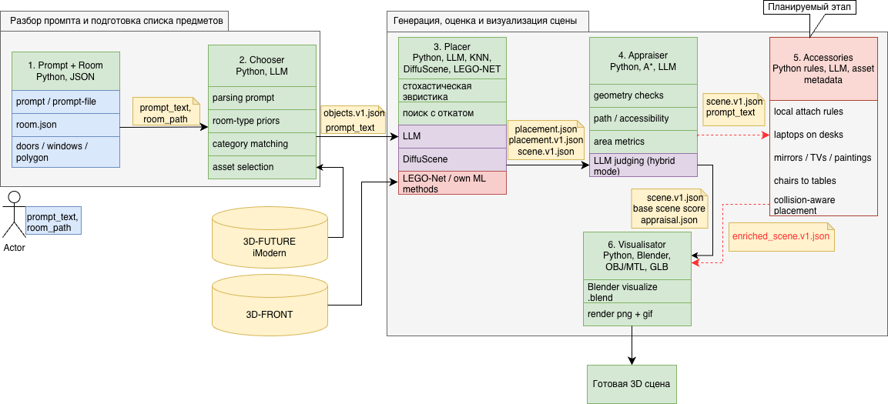

# Генерация дизайна помещения по тексту и плану

Репозиторий бакалаврской ВКР, посвящённой автоматической генерации интерьерной 3D-сцены по текстовому описанию и плану комнаты.

Система принимает описание помещения и текстовый запрос пользователя, подбирает подходящие объекты мебели, расставляет их с учётом геометрических ограничений, проверяет корректность сцены и экспортирует результат в структурированном формате и в Blender.

## Что делает проект

Проект реализует конвейер генерации интерьерной сцены:

1. получает **план комнаты** и **текстовый prompt**;
2. переводит запрос в список нужных объектов;
3. выбирает подходящие 3D-ассеты;
4. расставляет объекты одним из нескольких методов;
5. проверяет качество сцены;
6. экспортирует результат в JSON и в 3D-представление для Blender.

Основная цель проекта — сократить время и стоимость подготовки интерьерных 3D-сцен для застройщиков, дизайнеров и исследовательских задач, где нужно быстро получать несколько корректных вариантов компоновки.

## Ключевые возможности

- поддержка входа в виде **плана комнаты** и **текстового описания**;
- выбор мебели на основе категорий, размеров, стиля, темы и материала;
- несколько режимов расстановки:
  - эвристические;
  - LLM-based;
  - retrieval / KNN;
  - внешние ML- и diffusion-подходы;
- валидация сцены:
  - проверка нахождения объектов внутри комнаты;
  - проверка коллизий;
  - проверка проходов и доступности через A*;
  - оценка соответствия prompt и ограничений;
- экспорт итоговой сцены в JSON, `.blend`, изображения и GIF;
- пакетная генерация и массовая оценка на наборе типовых комнат.

## Общая схема пайплайна

```text
Prompt + Room
    -> Chooser
    -> Placer
    -> Appraiser
    -> Visualizer / Blender Export
```

### Диаграмма пайплайна



> Диаграмма хранится в репозитории как `diagram.drawio.png` в корне проекта, поэтому GitHub отображает её напрямую через относительный путь.

### Пояснение к диаграмме

Диаграмма отражает основной поток данных и логику модулей проекта.

- **Prompt + Room** — входные данные: текстовое описание, план комнаты, JSON/GLB-геометрия и служебные ограничения.
- **Chooser** — модуль на Python, который извлекает из prompt список объектов, сопоставляет категории мебели и подбирает ассеты по метаданным. Здесь используются эвристики, словари категорий и при необходимости LLM через `Ollama`.
- **Placer** — модуль расстановки объектов. Внутри используются эвристические алгоритмы (`random`, `relaxed`), retrieval/KNN-подход, LLM-layout, а также интеграции с внешними методами вроде `DiffuScene` и bridge/postprocess для `LEGO-Net`.
- **Appraiser** — модуль оценки качества сцены. Он считает геометрические метрики, проверяет коллизии, границы комнаты, доступность и проходимость через `A*`, а также может добавлять LLM-оценку.
- **Visualizer / Blender Export** — финальный этап, где сцена сериализуется в канонический JSON, собирается в `Blender`, рендерится в `.png`, сохраняется в `.blend` и при необходимости экспортируется в GIF.

Иными словами, диаграмма показывает переход от текстового задания и плана помещения к структурированной сцене, затем к оценке качества и к визуальному результату.

### 1. Prompt + room
На вход подаются:

- текстовый prompt, например: `classic cozy bedroom with king-size bed, two nightstands, wardrobe and ceiling lamp`;
- описание помещения в JSON / GLB.

Описание комнаты включает геометрию и служебные поля, например:

- `version`, `units`, `coordinate_system`;
- `room.id`, `room.name`;
- `ceiling_height`;
- `floor_polygon`;
- `walls`, `doors`, `windows`.

### 2. Chooser
Модуль `Chooser`:

- переводит prompt в список объектов и их количества;
- может работать по эвристикам или через LLM;
- сопоставляет категории мебели с библиотекой ассетов;
- отбрасывает неподходящие по размерам модели;
- ранжирует кандидатов по метаданным ассета.

Выход этого этапа: `objects.json` / `objects.v1.json`.

### 3. Placer
Модуль расстановки поддерживает несколько стратегий.

#### Эвристические режимы
- **random** — случайный перебор допустимых размещений;
- **relaxed** — более управляемый поиск по кандидатам с backtracking.

Обе стратегии учитывают:

- размещение у стен при `touch_wall`;
- допустимые повороты;
- нахождение внутри комнаты;
- отсутствие пересечений;
- clearance-ограничения;
- корректный контакт со стеной / полом.

#### LLM placer
Использует языковую модель для построения layout и последующего заполнения / исправления JSON-структуры.

#### Retrieval / KNN
Подбирает наиболее похожую комнату из 3D-FRONT по геометрии и набору объектов и адаптирует найденную расстановку.

#### Внешние ML / diffusion-модули
В репозитории присутствуют интеграции и заготовки для:

- `DiffuScene`;
- ML-baselines;
- `LEGO-Net` postprocess / bridge;
- graph/statistical методов.

### 4. Appraiser
Модуль `Appraiser` оценивает сцену в нескольких режимах:

- `heuristic`;
- `llm`;
- `hybrid`.

Что считается:

- геометрические метрики;
- пересечения и выход за границы;
- свободная площадь;
- доступность объектов и проходов;
- соответствие prompt;
- выполнение дополнительных ограничений.

Результат сохраняется в `appraisal.json`.

### 5. Visualizer / Blender export
Этап визуализации:

- собирает сцену для Blender;
- импортирует комнату и объекты;
- создаёт `.blend`;
- рендерит изображение;
- может строить orbit GIF;
- пытается восстановить материалы и текстуры для OBJ/MTL-ассетов.

## Структура репозитория

Ниже — укрупнённая структура проекта.

```text
config/                  конфигурация путей и окружения
  paths.yaml

data/
  input/                 входные комнаты, тестовые JSON, превью, маски
  output/                промежуточные результаты, отладка, sample-сцены
  sourse/                датасеты, модели, текстуры, библиотеки ассетов

out/                     итоговые сцены, blend-файлы, рендеры, временные прогоны
reports/                 отчёты и сравнения методов
runs/                    сохранённые эксперименты и обученные артефакты

src/
  Appraiser/             оценка качества сцен
  ChooseObject/          выбор объектов и категорий
  LLMModule/             работа с LLM, JSON-repair, Ollama
  Plasement/             расстановка, проверки, Blender-интеграция
  ml/                    ML-бейзлайны, метрики, инференс, обучение
  tools/                 пакетные утилиты, конвертеры, экспорт, сравнение
  run_pipeline.py        главный сценарий запуска пайплайна
```

## Основные каталоги и модули

### `config/`
- `paths.yaml` — центральная конфигурация путей, внешних скриптов и окружений.

### `data/input/`
Входные данные и тестовые примеры:

- типовые комнаты в `generated_typical_rooms/`;
- тестовые room JSON;
- `room.glb`, `room_thick_walls_and_floor.glb`;
- изображения и маски для проверки и предпросмотра.

### `data/sourse/`
Источник данных проекта:

- `3D-FRONT/`;
- `3D-FUTURE-model/`;
- предобработанные версии датасета;
- текстуры;
- `prepared_model_info.json` и связанные метаданные;
- дополнительные ассеты и база `imodern`.

### `src/run_pipeline.py`
Главная точка входа. Координирует:

- чтение входных данных;
- вызов `Chooser`;
- выбор и запуск нужного `Placer`;
- сборку финальной сцены;
- оценку качества;
- экспорт артефактов.

### `src/ChooseObject/`
Содержит логику выбора мебели.

Ключевой файл:

- `choose_obj_from_prepared.py` — подбор объектов из подготовленной базы моделей.

### `src/Plasement/`
Основной модуль расстановки и 3D-сборки. Название директории сохранено в текущем виде (`Plasement`).

Содержит, в частности:

- `CubePlacement.py` — эвристическая расстановка;
- `placement_checks.py` — проверки корректности;
- `pathfinding_astar.py` — проверка проходов и доступности;
- `run_ollama_layout.py` — LLM-расстановка;
- `run_diffuscene_remote.py` — вызов внешнего diffusion-пайплайна;
- `retrieval_knn_scene.py` — retrieval / KNN подход;
- `BlenderVisualizePlacement.py`, `blender_scene_builder.py` — сборка сцены в Blender.

### `src/LLMModule/`
Работа с языковыми моделями:

- `ollama_client.py` — клиент для Ollama;
- `placement_fill.py` — восстановление и нормализация JSON-ответов LLM;
- `retry_llm_json.py` — повторные попытки и стабилизация ответов;
- `probe_models.py` — проверка моделей;
- `keys_manager.py` и смежные утилиты.

### `src/Appraiser/`
Оценка качества готовой сцены:

- `appraiser.py` — основной интерфейс оценки;
- `area_appraiser.py` — геометрические метрики;
- `llm_appraiser.py` — LLM-оценка сцены.

### `src/ml/`
ML-компоненты и эксперименты:

- бейзлайны (`baselines/`);
- инференс (`infer/`);
- обучение (`train/`);
- метрики (`metrics/`);
- bridge и postprocess для `LEGO-Net`;
- diffusion placer и смежные утилиты.

### `src/tools/`
Служебные сценарии для:

- пакетной генерации комнат;
- батчевой оценки;
- конвертации сцен;
- визуализации;
- построения GIF;
- сравнения методов;
- подготовки данных.

## Основные форматы артефактов

В проекте используются несколько уровней представления сцены.

### `objects.v1`
Список выбранных объектов с метаданными и ограничениями.

### `placement.v1`
Результат расстановки: позиции, ориентации, размеры и служебные поля.

### `scene.v1`
Каноническое представление финальной сцены, включающее:

- геометрию комнаты;
- объекты;
- положения и ориентации;
- размеры;
- метаданные.

### Сопутствующие артефакты
- `appraisal.json` — оценка качества сцены;
- `.blend` — сцена Blender;
- `.png` — рендер;
- `.gif` — orbit-анимация;
- CSV / JSONL — пакетные метрики и сводки.

## Поддерживаемые методы расстановки

На текущий момент в репозитории представлены или частично интегрированы следующие подходы:

- `random`
- `relaxed`
- `ollama_llm`
- `retrieval_knn_scene`
- `DiffuScene` (через remote runner)
- ML baselines:
  - `forest`
  - `graph_stat`
  - `random_feasible`
  - `relaxed_cube`
- bridge / postprocess для `LEGO-Net`

## Быстрый старт

### 1. Что нужно
Минимально:

- Python;
- Blender — для сборки `.blend` и рендера;
- локальные данные комнаты и доступ к ассетам;
- настроенный `config/paths.yaml`.

Для LLM-режимов дополнительно нужен:

- Ollama или другой доступный LLM backend.

Для внешних diffusion / LEGO пайплайнов могут понадобиться:

- отдельное удалённое окружение;
- SSH-доступ;
- подготовленные чекпоинты и датасеты.

### 2. Настройка путей
Сначала проверьте файл:

```yaml
config/paths.yaml
```

В нём должны быть корректно указаны:

- корни датасетов;
- пути к ассетам;
- Blender-скрипты;
- локальные и удалённые окружения;
- временные и выходные директории.

### 3. Пример базового запуска
Пример запуска полного пайплайна:

```bash
python src/run_pipeline.py \
  --prompt "classic cozy bedroom with king-size bed, two nightstands, wardrobe and ceiling lamp" \
  --room data/input/room.json \
  --placer cube \
  --modes random
```

Пример запуска LLM-режима:

```bash
python src/run_pipeline.py \
  --prompt "classic cozy bedroom with king-size bed, two nightstands, wardrobe and ceiling lamp" \
  --room data/input/room.json \
  --placer ollama_llm
```

Пример запуска с сохранением сцены Blender и рендера:

```bash
python src/run_pipeline.py \
  --prompt "classic cozy bedroom with king-size bed, two nightstands, wardrobe and ceiling lamp" \
  --room data/input/room.json \
  --placer cube \
  --modes relaxed \
  --save-blend out/interior.blend \
  --render out/interior.png
```

Фактический набор аргументов зависит от выбранного метода и содержимого `paths.yaml`.

## Пакетные эксперименты

Для массовых прогонов и сравнения методов используются сценарии из `src/tools/`, например:

- `batch_generate_typical_rooms.py`
- `batch_generate_typical_rooms_llm.py`
- `batch_generate_typical_rooms_retrieval.py`
- `batch_appraise_and_export_metrics.py`
- `compare_batch_summaries.py`
- `batch_blend_to_orbit_gif.py`

Типовой сценарий:

1. сгенерировать набор сцен на типовых комнатах;
2. прогнать оценщик;
3. собрать CSV/JSONL-метрики;
4. построить итоговые сравнения.

## Датасеты и данные

Проект опирается на следующие источники данных:

- **3D-FRONT** — интерьерные сцены и геометрия комнат;
- **3D-FUTURE** — 3D-модели мебели;
- дополнительные локальные ассеты и текстуры;
- подготовленные таблицы и JSON с метаданными моделей.

В репозитории присутствуют как исходные данные, так и подготовленные / облегчённые производные версии.

## Статьи, датасеты и внешние проекты

Ниже приведены ключевые внешние источники, на которые опирается проект и с которыми связаны отдельные модули репозитория.

### Датасеты

- **3D-FRONT: 3D Furnished Rooms with layOuts and semaNTics**  
  Статья: <https://arxiv.org/abs/2011.09127>  
  DOI: <https://doi.org/10.48550/arXiv.2011.09127>

- **3D-FUTURE: 3D Furniture Shape with Texture**  
  Статья: <https://arxiv.org/abs/2009.09633>  
  Страница датасета: <https://tianchi.aliyun.com/dataset/94735>

### Методы и внешние проекты

- **DiffuScene: Denoising Diffusion Models for Generative Indoor Scene Synthesis**  
  Репозиторий: <https://github.com/tangjiapeng/DiffuScene>

- **LEGO-Net: Learning Regular Rearrangements of Objects in Rooms**  
  Статья: <https://arxiv.org/abs/2301.09629>

### Назначение этой секции

Эти ссылки вынесены в README для трёх практических целей:

- быстро переходить к статьям и официальным страницам при подготовке ВКР и презентации;
- понимать, какие внешние датасеты и методы использованы в проекте;
- упростить воспроизведение экспериментов и проверку источников.

## Что лежит в `out/`, `runs/` и `reports/`

### `out/`
Здесь появляются результаты конкретных запусков:

- итоговые `scene`/`placement` JSON;
- `.blend`;
- рендеры `.png`;
- retrieval-сцены;
- временные и отладочные артефакты.

### `runs/`
Хранятся папки экспериментов, отладочные запуски и результаты отдельных режимов / моделей.

### `reports/`
Содержит собранные визуальные и текстовые отчёты по сравнению методов.

## Оценка качества

Система учитывает несколько классов критериев:

- **геометрическая корректность**;
- **отсутствие пересечений**;
- **размещение внутри комнаты**;
- **доступность объектов**;
- **проходимость**;
- **соответствие prompt**;
- **выполнение ограничений**;
- **время генерации**.

Для LLM-оценки дополнительно используются качественные вопросы о:

- удобстве сцены;
- доступности объектов;
- проходах;
- логичности;
- правдоподобии.

## Ограничения текущей версии

- восстановление исходных материалов и текстур в Blender ещё нестабильно;
- качество LLM- и diffusion-методов зависит от модели и окружения;
- часть ML / remote-интеграций требует отдельной настройки вне коробки;
- некоторые внешние бейзлайны пока полезнее как исследовательские интеграции, чем как полностью автономные production-компоненты.

## Дальнейшее развитие

Планируемые направления:

- добавление новых методов расстановки;
- дальнейшая интеграция собственных ML-подходов;
- развитие интеграции `LEGO-Net`;
- улучшение материалов и текстур в Blender;
- добавление accessories и отделочных материалов;
- расширение набора экспериментов и сравнений.

## Для чего этот репозиторий полезен

Репозиторий может использоваться как:

- исследовательская база для генерации интерьерных layout;
- инженерный пайплайн для прототипирования мебельных сцен;
- основа для сравнения эвристических, retrieval-, LLM- и ML-подходов;
- задел для интеграции в прикладные системы визуализации недвижимости, VR/AR и design automation.

## Автор

**Григин Иван Алексеевич**  
Бакалаврская выпускная квалификационная работа  
Тема: **«Разработка системы генерации дизайна помещения по тексту и плану»**